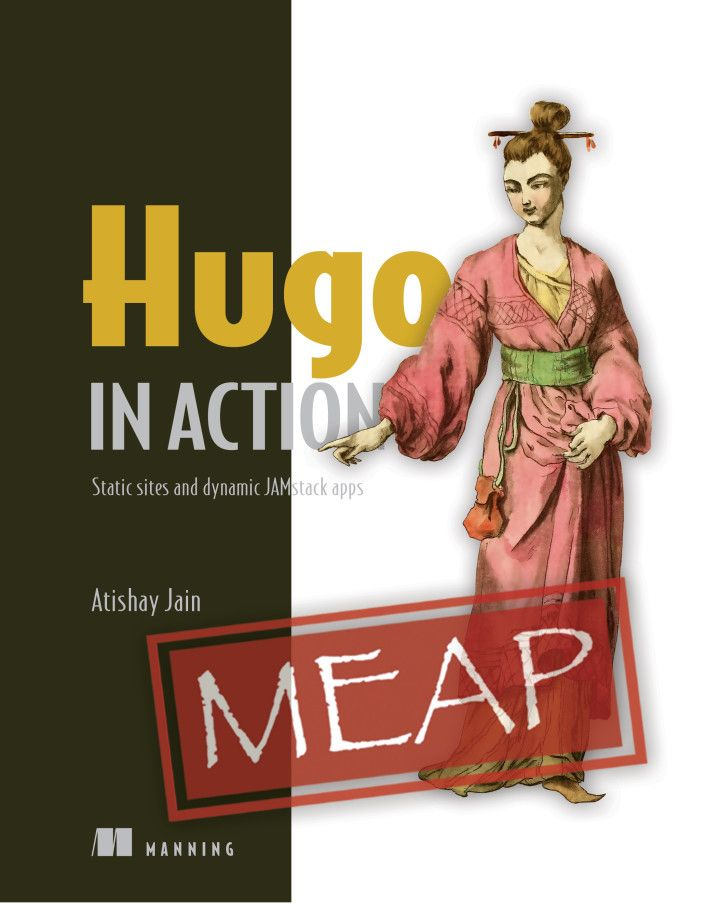

## 書籍 {#books}

### Hugo In Action

「Hugo in Action」は、Hugo を使って静的な Web サイトを作成するためのステップバイステップのガイドです。サードパーティのサーバに依存することなく、ユーザを驚かせ、安定性を維持する、メンテナンスが少なく、高性能なサイトを構築しホストする方法を学ぶことができます。

[Hugo In Action Home Page](https://www.manning.com/books/hugo-in-action)

### Build Websites with Hugo

[Build Websites with Hugo - Fast Web Development with Markdown (2020)](https://pragprog.com/titles/bhhugo/) by Brian P. Hogan.

## 初心者向けチュートリアル {#beginner-tutorials}

### CloudCannon による Hugo チュートリアル {#hugo-tutorial-by-cloudcannon}

[「ステップバイステップの書き方チュートリアル」](https://cloudcannon.com/community/learn/hugo-101/) で、Hugo サイト作成の基礎が学べます。

## 動画チュートリアル {#video-tutorials}

* Mike Dane が [YouTube](https://www.youtube.com/watch?list=PLLAZ4kZ9dFpOnyRlyS-liKL5ReHDcj4G3&v=qtIqKaDlqXo) の専用チュートリアルで Hugo のさまざまな機能について説明しています。

* [「はじめての Hugo サイト構築入門」](https://cloudcannon.com/community/learn/hugo-beginner-tutorial/) by Mike Neumegen.
