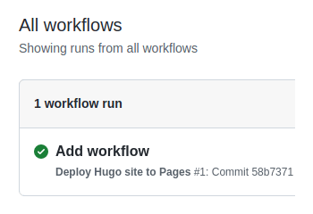

GitHub は、GitHub Pages サービスを通じて、GitHub リポジトリから直接、個人、組織、プロジェクトのページをSSL経由で無料かつ高速に静的ホスティングし、[GitHub Actions] で開発ワークフローとビルドを自動化します。

## 前提条件 {#Prerequisites}

1. [GitHub アカウントを作成する][Create a GitHub account]
2. [Git をインストールする][Install Git]
3. [Hugo サイトを作成][Create a Hugo site] し、`hugo server` を使ってローカルでテストする

[GitHub Actions]: https://docs.github.com/en/actions
[Create a GitHub account]: https://github.com/signup
[Install Git]: https://git-scm.com/book/en/v2/Getting-Started-Installing-Git
[Create a Hugo site]: /getting-started/quick-start/

## サイトの種類 {#types-of-sites}

GitHub Pages サイトには、プロジェクト、ユーザー、組織の 3 種類があります。 プロジェクト サイトは、GitHub でホストされている特定のプロジェクトに接続されています。 ユーザーおよび組織のサイトは、GitHub.com の特定のアカウントに接続されています。

{}
リポジトリの所有権と名前に関する要件を理解するには、[GitHub Pages ドキュメント][GitHub Pages documentation] を参照してください。
{}

[GitHub Pages documentation]: https://docs.github.com/en/pages/getting-started-with-github-pages/about-github-pages#types-of-github-pages-sites

## 手順 {#procedure}

ステップ 1
: GitHub リポジトリを作成します。

ステップ 2
: ローカル リポジトリを GitHub にプッシュします。

ステップ 3
: GitHub リポジトリにアクセスします。メインメニューから **Settings**&nbsp;>&nbsp;**Pages** を選択します。画面の中央に以下のように表示されます。


{style="max-width: 280px"}

ステップ 4
: **Source** を `GitHub Actions` に変更します。 変化は即座に起こります。 「保存」ボタンを押す必要はありません。


{style="max-width: 280px"}

ステップ 5
: ローカル リポジトリに空のファイルを作成します。

```text
.github/workflows/hugo.yaml
```

ステップ 6
: 以下の YAML をコピーして、作成したファイルに貼り付けます。 必要に応じてブランチ名と Hugo バージョンを変更します。


# Hugo サイトをビルドして GitHub Pages にデプロイするためのサンプル ワークフロー
name: Deploy Hugo site to Pages

on:
  # デフォルト ブランチをターゲットとしたプッシュで実行されます
  push:
    branches:
      - main

  # 「Action」タブからこのワークフローを手動で実行できます
  workflow_dispatch:

# GITHUB_TOKEN のパーミッションを設定し、GitHub Pages へのデプロイを許可します
permissions:
  contents: read
  pages: write
  id-token: write

# 同時デプロイメントは 1 つだけ許可し、進行中の実行と最後にキューに入れられた実行の間でキューに入れられた実行をスキップします。
# しかし、本番環境でのデプロイを完了させたいので、実行中のデプロイをキャンセルしないでください。
concurrency:
  group: "pages"
  cancel-in-progress: false

# デフォルトは bash
defaults:
  run:
    shell: bash

jobs:
  # ビルドジョブ
  build:
    runs-on: ubuntu-latest
    env:
      HUGO_VERSION: 0.115.1
    steps:
      - name: Install Hugo CLI
        run: |
          wget -O ${{ runner.temp }}/hugo.deb https://github.com/gohugoio/hugo/releases/download/v${HUGO_VERSION}/hugo_extended_${HUGO_VERSION}_linux-amd64.deb \
          && sudo dpkg -i ${{ runner.temp }}/hugo.deb
      - name: Install Dart Sass
        run: sudo snap install dart-sass
      - name: Checkout
        uses: actions/checkout@v3
        with:
          submodules: recursive
          fetch-depth: 0
      - name: Setup Pages
        id: pages
        uses: actions/configure-pages@v3
      - name: Install Node.js dependencies
        run: "[[ -f package-lock.json || -f npm-shrinkwrap.json ]] && npm ci || true"
      - name: Build with Hugo
        env:
          # For maximum backward compatibility with Hugo modules
          HUGO_ENVIRONMENT: production
          HUGO_ENV: production
        run: |
          hugo \
            --gc \
            --minify \
            --baseURL "${{ steps.pages.outputs.base_url }}/"
      - name: Upload artifact
        uses: actions/upload-pages-artifact@v1
        with:
          path: ./public

  # デプロイジョブ
  deploy:
    environment:
      name: github-pages
      url: ${{ steps.deployment.outputs.page_url }}
    runs-on: ubuntu-latest
    needs: build
    steps:
      - name: Deploy to GitHub Pages
        id: deployment
        uses: actions/deploy-pages@v2


ステップ 7
: 変更をローカルリポジトリにコミットし、"Add workflow" のようなコミットメッセージを添えて GitHub にプッシュします。

ステップ 8
: GitHub のメインメニューから **Actions** を選びます。 以下のように表示されます。


{style="max-width: 350px"}

ステップ 9
: GitHub がサイトのビルドとデプロイを完了すると、ステータスインジケータの色が緑に変わります。


{style="max-width: 350px"}

ステップ 10
: 上の図のようにコミット メッセージをクリックしてください。以下のように表示されます。


{style="max-width: 611px"}

デプロイ手順の下に、ライブ サイトへのリンクが表示されます。

今後、ローカル リポジトリから変更をプッシュするたびに、GitHub はサイトを再構築し、変更をデプロイします。

## 追加情報 {#additional-resources}

- [Learn more about GitHub Actions](https://docs.github.com/en/actions)
- [Caching dependencies to speed up workflows](https://docs.github.com/en/actions/using-workflows/caching-dependencies-to-speed-up-workflows)
- [Manage a custom domain for your GitHub Pages site](https://docs.github.com/en/pages/configuring-a-custom-domain-for-your-github-pages-site/about-custom-domains-and-github-pages)
